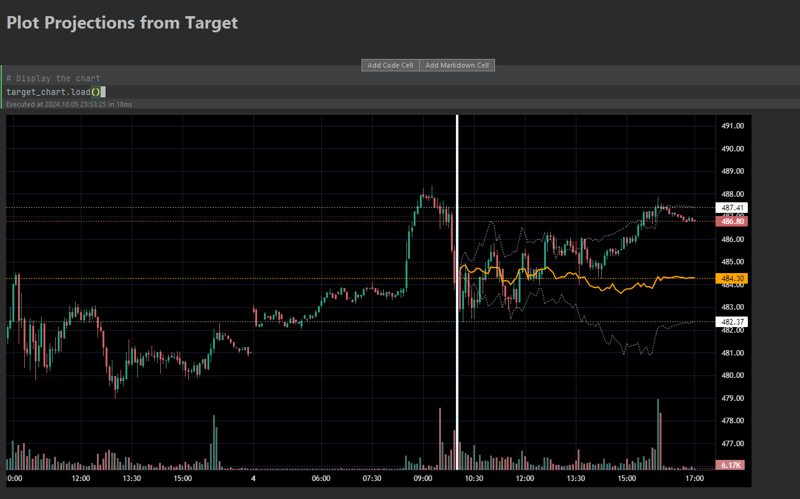

# Market Span Cluster

Search historical market data for similar time ranges using [Dynamic Time Warping](https://en.wikipedia.org/wiki/) distance.

The user provides an end timestamp, a start time of day, and a lookback range in days. We will search the historical data
for similar time ranges, and return the top N matches. The matches are scored using one of several methods, all using
DTW. The default method will run DTW on the highs, lows, and close, and return the average, with double weight on the
close (hlc4). 

The top matches can be viewed using the widget, plotted with Tradingview lightweight charts. Also, projection bands
can be plotted, using the average of the top matches.

These main entrypoint is the Jupyter notebook `notebooks\search.ipynb`.



## Project Organization
This project was initially generated using the [Cookiecutter Data Science](https://cookiecutter-data-science.drivendata.org) 
template, then trimmed down.

```
├── LICENSE
├── Makefile              <- Makefile for convenience commands like `make data` or `make train`
├── README.md
├── docs 
├── data
│   ├── processed         <- The final, canonical data sets for modeling.
│   └── raw               <- The original, immutable data dump.
├── market_span_cluster   <- Source code for use in this project
├── notebooks
│   └── search.py         <- search.py the main app.
├── pyproject.toml
└── requirements.in
└── requirements.txt
```

--------

